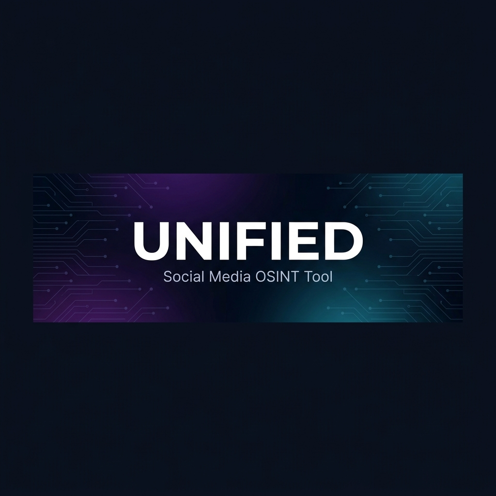

<p align="center">

</p>

<p align="center">
<a href="https://python.org"></a>
<a href="https://fastapi.tiangolo.com"></a>
<a href="https://react.dev"></a>
<a href="https://www.mongodb.com"></a>
<a href="https://playwright.dev"></a>
</p>

<p align="center">
<a href="#installation">Installation</a> · <a href="#features">Features</a> · <a href="#usage">Usage</a> · <a href="#api-reference">API</a> · <a href="#configuration">Config</a> · <a href="docs/ARCHITECTURE.md">Architecture</a>
</p>

---

**Unified Social Media Tool** is an OSINT automation platform for discovering, triaging, and analyzing social media profiles across Facebook, Instagram, Twitter/X, YouTube, and Telegram. Built for threat intelligence teams conducting brand impersonation investigations and fraudulent account identification.

The tool provides a web-based UI powered by React and a FastAPI backend with Playwright-based stealth browser automation. YouTube and Telegram use their official APIs.

<p align="center">

</p>

---

## Features

- **Multi-platform discovery** — Keyword-based search across 5 platforms simultaneously
- **Deep profile analysis** — Extract followers, bio, location, creation date, last activity, verification status
- **Three-state triage** — Pending → Approved / Rejected workflow with bulk operations
- **Batch URL export** — Copy or analyze ALL validated URLs from the entire database, not just the current page
- **Real-time monitoring** — WebSocket-powered live progress during analysis, per-platform health scores
- **Stealth automation** — Browser fingerprint randomization, human behavior simulation, TLS-fingerprinted HTTP
- **Session persistence** — Cookie-based auth that survives restarts, with automatic health validation
- **Concurrent scraping** — 3 browser tabs or 6 API workers running in parallel
- **Excel export** — One-click `.xlsx` export with full profile metadata
- **Cron scheduling** — Automated recurring discovery and analysis jobs
- **Multi-client** — Isolated databases per client for clean data separation

### Platform Support

| Platform | Discovery | Analysis | Auth |
|:---------|:----------|:---------|:-----|
| Facebook | Keyword search | Full profile | Cookie session |
| Instagram | Keyword search | Profile + posts | Cookie session |
| Twitter/X | Keyword search | Profile + metrics | Cookie session |
| YouTube | API search | Channel analytics | API key |
| Telegram | API search | Channel/group info | Telethon session |

---

## Installation

Requires **Python 3.10+**, **Node.js 18+**, **MongoDB 6.0+**.

```bash
git clone https://github.com/Saisanjay23/unifiedtool-og.git
cd unifiedtool-og
python -m venv venv
venv\Scripts\activate
pip install -r requirements.txt
playwright install chromium
cp .env.example .env    # edit with your MongoDB URI and API keys
python home.py --build
python home.py
```

Open `http://localhost:9000`.

---

## Usage

### Getting Started

1. Create a client from the sidebar (`+ New`)
2. Go to **Sessions** and log in to each platform
3. Select a platform → enter keywords → **Start Discovery**
4. Review results → **Validate** or **Reject** profiles
5. Switch to **Validated** tab → **Analyze ALL Validated**

### CLI

```bash
python home.py                    # start server on port 9000
python home.py --port 8080        # custom port
python home.py --build            # rebuild React frontend
python home.py --login facebook   # interactive browser login
python home.py --cron             # start cron scheduler
```

### Screenshots

<table>
<tr>
<td></td>
<td></td>
</tr>
<tr>
<td align="center"><b>Discovery</b> — Keyword search with results grid</td>
<td align="center"><b>Validated</b> — Batch actions and profile cards</td>
</tr>
<tr>
<td></td>
<td></td>
</tr>
<tr>
<td align="center"><b>Sessions</b> — Multi-platform authentication</td>
<td align="center"><b>Dashboard</b> — Health rings and job stats</td>
</tr>
</table>

---

## API Reference

| Method | Endpoint | Description |
|:-------|:---------|:------------|
| `POST` | `/discover/{platform}` | Start keyword discovery |
| `POST` | `/analyze/{platform}` | Start profile analysis |
| `GET` | `/results/{client}` | Paginated results with filters |
| `GET` | `/results/{client}/validated-urls` | All validated URLs (no pagination) |
| `PATCH` | `/results/{client}/{id}` | Update profile status |
| `GET` | `/export/{client}` | Download Excel report |
| `GET` | `/sessions` | List session status |
| `POST` | `/sessions/{platform}/validate` | Validate a session |
| `GET` | `/health` | Platform health scores |
| `WS` | `/ws/progress/{job_id}` | Live analysis progress |

---

## Configuration

Copy `.env.example` to `.env`. Key variables:

```ini
# Database
MONGO_URI=mongodb://localhost:27017

# Platform APIs (YouTube + Telegram only)
YOUTUBE_API_KEY=
TELEGRAM_API_ID=
TELEGRAM_API_HASH=
TELEGRAM_PHONE=

# Performance
ANALYSIS_CONCURRENT_TABS=3          # browser-based platforms
ANALYSIS_API_CONCURRENT_TABS=6      # API-based platforms
MAX_CONCURRENT_PROFILES=3

# Rate limits (requests/hour)
RATE_LIMIT_FACEBOOK=30
RATE_LIMIT_INSTAGRAM=60
RATE_LIMIT_TWITTER=40
RATE_LIMIT_YOUTUBE=100
RATE_LIMIT_TELEGRAM=80
```

See [`.env.example`](.env.example) for the full list.

---

## Project Structure

```
backend/
  api/            FastAPI routes, WebSocket progress stream
  core/           Config, MongoDB, job manager, health engine, session validator
  platforms/      Per-platform discovery + analysis (Facebook, Instagram, Twitter, YouTube, Telegram)
  stealth/        Browser pool, fingerprint spoofing, human simulation, stealth HTTP
frontend/
  src/            React 18 SPA (Dashboard, PlatformView, ResultsGrid, SessionLogin)
  dist/           Production build (git-ignored)
home.py           Entrypoint — server, build, login, cron
```

See [docs/ARCHITECTURE.md](docs/ARCHITECTURE.md) for the full technical breakdown.

---

## Troubleshooting

| Problem | Fix |
|:--------|:----|
| Port in use | `netstat -ano \| findstr :9000` → `taskkill /PID <pid> /F` |
| Session expired | Re-login via Sessions page or `python home.py --login <platform>` |
| MongoDB error | Ensure `mongod` is running |
| Frontend stale | `python home.py --build` then hard-refresh (`Ctrl+Shift+R`) |
| Rate limited | Wait for hourly reset or lower `RATE_LIMIT_*` in `.env` |

See [docs/OPERATIONS.md](docs/OPERATIONS.md) for more.

---

## Tech Stack

| Component | Technology |
|:----------|:-----------|
| Backend | FastAPI, Uvicorn, Motor (async MongoDB) |
| Frontend | React 18, Vite |
| Browser | Playwright with stealth fingerprinting |
| HTTP | curl_cffi (TLS impersonation), aiohttp |
| Telegram | Telethon (MTProto) |
| YouTube | Google API Python Client |
| Scheduling | APScheduler |
| Export | Pandas, openpyxl |

---

<p align="center">
<sub>Built for threat intelligence. Designed for speed.</sub>
</p>
