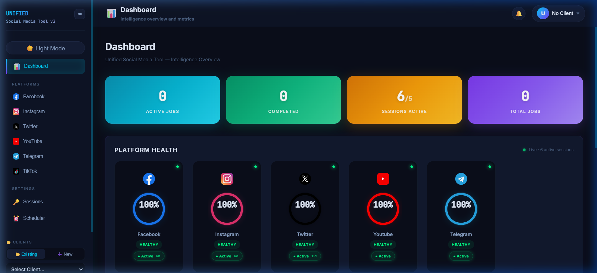
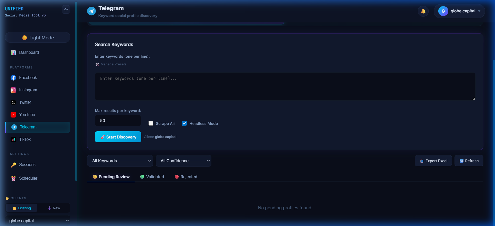
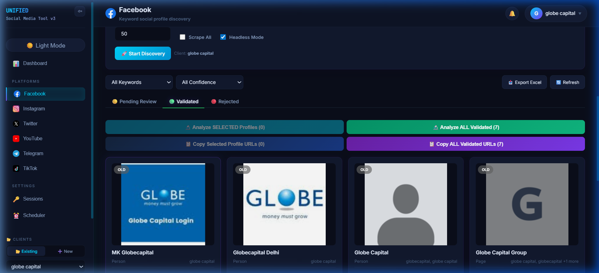
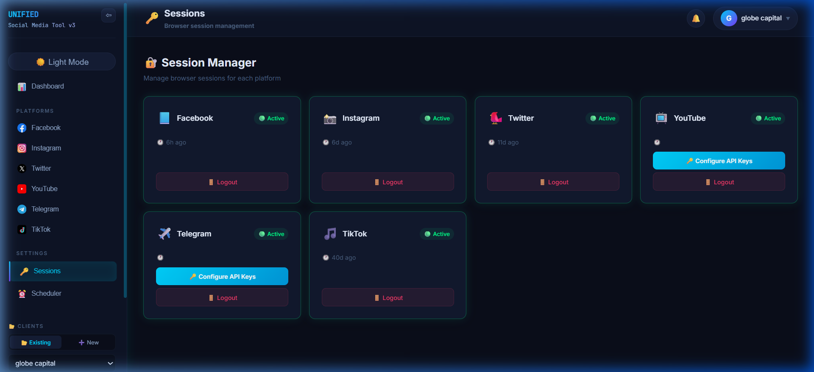

<](https://python.org)
[](https://fastapi.tiangolo.com)
[](https://react.dev)
[](https://mongodb.com)
[](https://playwright.dev)
[]()

</div>

---

## 📸 Screenshots

<details>
<summary><b>🖥️ Dashboard — Real-time Intelligence Overview</b></summary>



</details>

<details>
<summary><b>🔎 Discovery — Keyword-Based Profile Search</b></summary>



</details>

<details>
<summary><b>✅ Validated Profiles — Batch Actions & Export</b></summary>



</details>

<details>
<summary><b>🔐 Session Manager — Multi-Platform Auth</b></summary>



</details>

---

## 🎯 What It Does

The Unified Social Media OSINT Tool automates the discovery, validation, and analysis of social media profiles across **6 major platforms**. It is designed for threat intelligence teams to identify brand impersonation, fraudulent accounts, and unauthorized usage of company names/keywords across social media.

### Supported Platforms

| Platform | Discovery | Analysis | Auth Method |
|----------|-----------|----------|-------------|
| 🔵 **Facebook** | ✅ Keyword search | ✅ Full profile scraping | Cookie-based session |
| 📸 **Instagram** | ✅ Keyword search | ✅ Profile + post data | Cookie-based session |
| ✖️ **Twitter / X** | ✅ Keyword search | ✅ Profile + metrics | Cookie-based session |
| 🔴 **YouTube** | ✅ API-powered search | ✅ Channel analytics | YouTube Data API key |
| ✈️ **Telegram** | ✅ API-powered search | ✅ Channel/group info | Telethon API session |
| 🎵 **TikTok** | 🚧 Planned | 🚧 Planned | — |

---

## ⚡ Key Features

### 🔎 Discovery Engine
- **Multi-keyword batch search** — Search multiple keywords simultaneously across any platform
- **Configurable result limits** — Control how many results per keyword (default: 50)
- **Headless/headed modes** — Run browser scraping in headless mode for speed or headed for debugging
- **Scrape All mode** — Exhaustive scraping that fetches all available results
- **Keyword presets** — Save and reuse keyword sets for recurring investigations

### 🧠 Profile Analysis
- **Deep profile extraction** — Followers, following, posts, bio, location, creation date, verification status
- **Activity timeline** — Last post date to gauge account activity
- **Concurrent analysis** — Analyze 3 browser-based profiles or 6 API-based profiles simultaneously
- **Real-time progress** — WebSocket-powered live progress feed during analysis

### ✅ Validation Workflow
- **Three-state triage** — Pending → Validated (Approved) / Rejected
- **Bulk operations** — Validate All, Reject All with one click
- **Confidence scoring** — HIGH / MEDIUM / LOW confidence badges
- **Age detection** — NEW / OLD badges based on profile creation date

### 📋 Batch Operations
- **Copy ALL Validated URLs** — Fetches ALL validated URLs from the database (not limited to current page)
- **Analyze ALL Validated** — Send all validated profiles to analysis in one click
- **Select & Analyze** — Cherry-pick specific profiles for targeted analysis
- **Excel Export** — Export results with full metadata to `.xlsx`

### 🛡️ Stealth & Anti-Detection
- **Browser fingerprint randomization** — Canvas, WebGL, fonts, navigator spoofing
- **Human behavior simulation** — Random delays, mouse movements, scroll patterns
- **Session persistence** — Cookie-based authentication survives browser restarts
- **Rate limiting** — Per-platform hourly rate limits to avoid bans
- **Stealth HTTP client** — `curl_cffi` with TLS fingerprint impersonation for API calls
- **Resource blocklist** — Blocks tracking pixels, analytics, and heavy media to speed up scraping

### 📊 Dashboard & Monitoring
- **Real-time health rings** — Per-platform health scores (Healthy/Degraded/Critical)
- **Session status tracking** — Live session age, active/inactive indicators
- **Job monitoring** — Active jobs, completed count, total jobs
- **WebSocket live feed** — Real-time analysis progress without polling

### 🔄 Automation
- **Cron scheduling** — Automated recurring discovery/analysis jobs via `cron_jobs.json`
- **Background job queue** — Non-blocking job execution with cleanup

---

## 🏗️ Architecture

```
┌─────────────────────────────────────────────────────────┐
│                    React Frontend (Vite)                  │
│  Dashboard │ PlatformView │ ResultsGrid │ SessionLogin   │
└───────────────────────┬─────────────────────────────────┘
                        │ HTTP / WebSocket
┌───────────────────────▼─────────────────────────────────┐
│               FastAPI Backend (Uvicorn)                   │
│                                                          │
│  ┌─────────┐  ┌──────────┐  ┌────────────┐  ┌────────┐ │
│  │ Routes  │  │WebSocket │  │ Job Manager│  │ Health │ │
│  │ API     │  │ Progress │  │ + Pool     │  │ Writer │ │
│  └────┬────┘  └────┬─────┘  └─────┬──────┘  └────┬───┘ │
│       │            │              │               │      │
│  ┌────▼────────────▼──────────────▼───────────────▼───┐ │
│  │              Platform Modules                      │ │
│  │  Facebook │ Instagram │ Twitter │ YouTube│Telegram │ │
│  │  (Playwright)  (Playwright) (Playwright) (API)  (API)│ │
│  └────────────────────┬───────────────────────────────┘ │
│                       │                                  │
│  ┌────────────────────▼───────────────────────────────┐ │
│  │           Stealth Layer                            │ │
│  │  Browser Pool │ Fingerprint │ Human │ HTTP Client  │ │
│  └────────────────────────────────────────────────────┘ │
└───────────────────────┬─────────────────────────────────┘
                        │
                ┌───────▼───────┐
                │   MongoDB     │
                │  (per-client  │
                │   databases)  │
                └───────────────┘
```

### Repository Layout

```text
unifiedtool-og/
├── home.py                 # Main entrypoint (server, build, login, cron)
├── requirements.txt        # Python dependencies
├── .env.example            # Environment configuration template
├── cron_jobs.json          # Scheduled job definitions
│
├── backend/
│   ├── api/
│   │   ├── router.py       # FastAPI app factory + static file serving
│   │   ├── websocket.py    # WebSocket progress stream
│   │   └── routes/
│   │       ├── discovery.py    # POST /discover/{platform}
│   │       ├── analysis.py     # POST /analyze/{platform}
│   │       ├── results.py      # GET/PATCH results, validated-urls
│   │       ├── sessions.py     # Session management endpoints
│   │       ├── health.py       # GET /health
│   │       ├── clients.py      # Client CRUD
│   │       └── export.py       # Excel export
│   │
│   ├── core/
│   │   ├── config.py           # Pydantic settings from .env
│   │   ├── db.py               # MongoDB operations (motor async)
│   │   ├── jobs.py             # JobManager + BrowserPool orchestration
│   │   ├── health.py           # Platform health scoring engine
│   │   ├── session_validator.py # Cross-platform session validation
│   │   ├── cron.py             # APScheduler integration
│   │   ├── logger.py           # Structured logging
│   │   ├── runtime.py          # Python version enforcement
│   │   └── fs.py               # Filesystem helpers
│   │
│   ├── platforms/
│   │   ├── base.py             # Abstract base platform class
│   │   ├── utils.py            # Shared scraping utilities
│   │   ├── facebook/           # Discovery + Analysis
│   │   ├── instagram/          # Discovery + Analysis
│   │   ├── twitter/            # Discovery + Analysis
│   │   ├── youtube/            # Discovery + Analysis (API)
│   │   ├── telegram/           # Discovery + Analysis (API)
│   │   └── tiktok/             # Planned
│   │
│   └── stealth/
│       ├── browser.py          # Playwright browser manager + session loader
│       ├── browser_pool.py     # Concurrent browser tab pool
│       ├── fingerprint.py      # Canvas/WebGL/Navigator fingerprint spoofing
│       ├── human.py            # Human behavior simulation
│       ├── headers.py          # Randomized HTTP headers
│       ├── http_client.py      # curl_cffi stealth HTTP client
│       ├── blocklist.py        # Resource blocking (ads, trackers)
│       └── proxy.py            # Proxy rotation support
│
├── frontend/
│   ├── src/
│   │   ├── App.jsx             # Root app with routing
│   │   ├── main.jsx            # React entry point
│   │   ├── api/client.js       # Axios API client
│   │   ├── store/              # State management
│   │   ├── components/
│   │   │   ├── Dashboard.jsx       # Intelligence overview
│   │   │   ├── PlatformView.jsx    # Discovery + Analysis tabs
│   │   │   ├── ResultsGrid.jsx     # Profile cards grid
│   │   │   ├── AnalysisPanel.jsx   # Analysis launcher
│   │   │   ├── AnalysisResultsGrid.jsx  # Analysis results
│   │   │   ├── SessionLogin.jsx    # Session management UI
│   │   │   ├── JobMonitor.jsx      # Real-time job tracking
│   │   │   ├── HealthRing.jsx      # SVG health ring component
│   │   │   ├── ClientManager.jsx   # Client CRUD
│   │   │   ├── KeywordPresets.jsx   # Keyword preset manager
│   │   │   ├── CronManager.jsx     # Cron job UI
│   │   │   ├── PlatformIcon.jsx    # Platform icon renderer
│   │   │   ├── Toast.jsx           # Notification system
│   │   │   └── ErrorBoundary.jsx   # React error boundary
│   │   └── styles/
│   │       └── theme.css           # Complete design system
│   └── dist/                   # Production build output (git-ignored)
│
├── docs/
│   ├── ARCHITECTURE.md         # Technical architecture notes
│   ├── OPERATIONS.md           # Operations & troubleshooting
│   └── screenshots/            # UI screenshots
│
├── sessions/                   # Platform session cookies (git-ignored)
└── logs/                       # Application logs (git-ignored)
```

---

## 🚀 Quick Start

### Prerequisites

| Requirement | Version | Notes |
|-------------|---------|-------|
| **Python** | 3.10 – 3.14 | 3.11 recommended |
| **Node.js** | 18+ | For frontend build |
| **MongoDB** | 6.0+ | Local or Atlas |
| **Chromium** | Latest | Installed via Playwright |

### Installation

```powershell
# 1. Clone the repository
git clone https://github.com/Saisanjay23/unifiedtool-og.git
cd unifiedtool-og

# 2. Create Python virtual environment
python -m venv venv
venv\Scripts\activate          # Windows
# source venv/bin/activate     # macOS/Linux

# 3. Install Python dependencies
pip install -r requirements.txt

# 4. Install Playwright browser
playwright install chromium

# 5. Configure environment
copy .env.example .env
# Edit .env with your MongoDB URI, API keys, etc.

# 6. Build frontend
python home.py --build

# 7. Start the server
python home.py
```

Open **http://localhost:9000** in your browser.

### First-Time Setup

1. **Create a client** — Click `+ New` in the sidebar and enter a client name (e.g., `cyfirma`)
2. **Login to platforms** — Go to `Sessions` → click `Login` on each platform → authenticate in the browser window that opens
3. **Start discovering** — Select a platform → enter keywords → click `Start Discovery`
4. **Triage results** — Review discovered profiles → `Validate` or `Reject` each one
5. **Analyze validated** — Switch to `Validated` tab → click `Analyze ALL Validated`

---

## ⚙️ Configuration

Create `.env` from `.env.example`. Key settings:

### Server
| Variable | Default | Description |
|----------|---------|-------------|
| `HOST` | `0.0.0.0` | Server bind address |
| `PORT` | `9000` | Server port |
| `DEBUG` | `false` | Debug mode |
| `LOG_LEVEL` | `INFO` | Logging verbosity |

### Database
| Variable | Default | Description |
|----------|---------|-------------|
| `MONGO_URI` | `mongodb://localhost:27017` | MongoDB connection string |
| `MONGO_DB_PREFIX` | `unified_tool` | Database name prefix |

### Platform APIs
| Variable | Description |
|----------|-------------|
| `YOUTUBE_API_KEY` | YouTube Data API v3 key |
| `TELEGRAM_API_ID` | Telegram API application ID |
| `TELEGRAM_API_HASH` | Telegram API application hash |
| `TELEGRAM_PHONE` | Phone number for Telegram auth |

### Performance Tuning
| Variable | Default | Description |
|----------|---------|-------------|
| `MAX_CONCURRENT_PROFILES` | `3` | Max profiles scraped in parallel |
| `MAX_CONCURRENT_JOBS` | `5` | Max background jobs |
| `ANALYSIS_CONCURRENT_TABS` | `3` | Browser tabs for analysis |
| `ANALYSIS_API_CONCURRENT_TABS` | `6` | API-based analysis concurrency |
| `ANALYSIS_INTER_PROFILE_DELAY` | `1.5` | Delay between profiles (seconds) |

### Rate Limits
| Variable | Default | Description |
|----------|---------|-------------|
| `RATE_LIMIT_FACEBOOK` | `30` | Max requests/hour |
| `RATE_LIMIT_INSTAGRAM` | `60` | Max requests/hour |
| `RATE_LIMIT_TWITTER` | `40` | Max requests/hour |
| `RATE_LIMIT_YOUTUBE` | `100` | Max requests/hour |
| `RATE_LIMIT_TELEGRAM` | `80` | Max requests/hour |

---

## 🖥️ CLI Commands

```powershell
# Start the server (default port 9000)
python home.py

# Start on a custom port
python home.py --port 8080

# Build the React frontend
python home.py --build

# Interactive browser login for a platform
python home.py --login facebook
python home.py --login instagram
python home.py --login twitter

# Run cron scheduler
python home.py --cron
```

---

## 🔌 API Reference

### Discovery
```
POST /discover/{platform}
Body: { "keywords": ["keyword1", "keyword2"], "max_results": 50, "headless": true }
```

### Analysis
```
POST /analyze/{platform}
Body: { "urls": ["https://facebook.com/profile1", ...] }
```

### Results
```
GET  /results/{client}?platform=facebook&status=approved&limit=20&offset=0
GET  /results/{client}/validated-urls?platform=facebook
PATCH /results/{client}/{profile_id}    Body: { "status": "approved" }
```

### Sessions
```
GET  /sessions
POST /sessions/{platform}/validate
POST /sessions/{platform}/login
```

### Health
```
GET /health
```

### Export
```
GET /export/{client}?platform=facebook&status=approved
```

### WebSocket
```
WS /ws/progress/{job_id}
```

---

## 🗄️ Data Model

Each discovered profile is stored in MongoDB with the following schema:

```json
{
  "_id": "ObjectId",
  "url": "https://facebook.com/profile",
  "display_name": "John Doe",
  "username": "johndoe",
  "platform": "facebook",
  "entity_type": "Person",
  "bio": "Software developer...",
  "followers": 1250,
  "following": 340,
  "posts_count": 89,
  "location": "Mumbai, India",
  "is_verified": false,
  "created_at": "2020-01-15",
  "last_post_date": "2025-12-01",
  "profile_image_url": "https://...",
  "confidence": "HIGH",
  "status": "pending",
  "keyword": "cyfirma",
  "keywords": ["cyfirma", "cyber security"],
  "discovered_at": "2026-05-05T08:30:00Z",
  "analyzed_at": null
}
```

**Status values:** `pending` → `approved` / `rejected`

**Confidence levels:** `HIGH` / `MEDIUM` / `LOW`

---

## 🔒 Security Notes

- **`.env`** — Contains credentials. Never commit to git.
- **`sessions/`** — Contains platform auth cookies. Never commit.
- **Session validation** — Automatic health checks verify session validity before scraping.
- **Stealth mode** — Browser fingerprints are randomized per session to avoid detection.
- **No data exfiltration** — All data stays in your local MongoDB instance.

---

## 🐛 Troubleshooting

| Problem | Solution |
|---------|----------|
| **Port already in use** | Kill the existing process: `netstat -ano \| findstr :9000` then `taskkill /PID <pid> /F` |
| **Session expired** | Re-login via `Sessions` page or `python home.py --login <platform>` |
| **MongoDB connection error** | Ensure MongoDB is running: `mongod --dbpath <path>` |
| **Playwright not installed** | Run `playwright install chromium` |
| **Frontend not loading** | Rebuild: `python home.py --build` |
| **Rate limited** | Wait for the hourly window to reset, or lower `RATE_LIMIT_*` values |
| **"Copy ALL" shows wrong count** | Hard refresh browser (`Ctrl+Shift+R`) to load latest JS bundle |

---

## 📦 Tech Stack

| Layer | Technology | Purpose |
|-------|-----------|---------|
| **Backend** | FastAPI + Uvicorn | Async REST API + WebSocket |
| **Frontend** | React 18 + Vite | SPA with real-time updates |
| **Database** | MongoDB + Motor | Async document storage |
| **Browser** | Playwright | Stealth browser automation |
| **Telegram** | Telethon | Telegram MTProto API |
| **YouTube** | Google API Client | YouTube Data API v3 |
| **HTTP** | curl_cffi + aiohttp | TLS-fingerprinted requests |
| **Scheduling** | APScheduler | Cron-style job scheduling |
| **Export** | Pandas + openpyxl | Excel report generation |

---

## 📝 Changelog

### v3.0 — May 2026
- ✅ Fixed batch operations (Copy/Analyze ALL) fetching all URLs from database instead of page-limited 20
- ✅ Consistent card layout across all platforms with pinned footer actions
- ✅ Keyword truncation in profile cards (max 2 + count badge)
- ✅ Stealth HTTP client with TLS fingerprint impersonation
- ✅ Resource blocklist for faster scraping
- ✅ Health scoring engine with degradation thresholds

### v2.0 — April 2026
- ✅ FastAPI migration from Streamlit monolith
- ✅ React SPA frontend with dark mode design
- ✅ WebSocket real-time progress
- ✅ Multi-client support with per-client databases
- ✅ Concurrent analysis with browser pool
- ✅ Session persistence and validation

### v1.0 — March 2026
- ✅ Initial Streamlit-based OSINT tool
- ✅ Facebook, Instagram, Twitter discovery
- ✅ Basic profile analysis

---

## 📄 Additional Documentation

- [`SETUP.md`](SETUP.md) — Detailed laptop setup guide
- [`docs/ARCHITECTURE.md`](docs/ARCHITECTURE.md) — Codebase structure and runtime flow
- [`docs/OPERATIONS.md`](docs/OPERATIONS.md) — Production hygiene and troubleshooting

---

<div align="center">

**Built for threat intelligence. Designed for speed.**

</div>
]]>
